# SPECIFICATIONS — Plataforma RLT / CLT

> Documentación oficial de la aplicación. Última actualización: marzo 2026.

---

## 1. Descripción General

La plataforma RLT (Rectores Líderes Transformadores) / CLT (Coordinadores Líderes Transformadores) es una aplicación web destinada a la gestión integral del programa de formación de directivos docentes en Colombia. Permite recopilar fichas de información, aplicar encuestas 360°, evaluar mediante rúbricas, generar informes de módulo, medir la satisfacción de los participantes y realizar seguimiento MEL (Monitoreo, Evaluación y Aprendizaje).

**Público objetivo**: Directivos docentes colombianos (rectores y coordinadores), evaluadores del programa, operadores regionales y administradores.

**Stack tecnológico**: React + TypeScript, Vite, Tailwind CSS, shadcn/ui, Supabase (Lovable Cloud), jsPDF para generación de PDFs.

---

## 2. Roles de Usuario

| Rol | Descripción | Acceso |
|-----|-------------|--------|
| **Directivo** | Rector o coordinador participante del programa. Llena fichas, responde encuestas, consulta rúbricas. | Páginas públicas, Mi Panel |
| **Evaluador** | Miembro del equipo de acompañamiento. Evalúa directivos mediante rúbricas por módulo. | Panel de evaluación de rúbricas |
| **Operador** | Responsable regional. Gestiona fichas, informes de módulo y asistencia de su región/entidad. | Panel de operador con permisos segmentados |
| **Administrador** | Gestión completa de la plataforma. | Panel de administración completo |
| **Superadmin** | Administrador con acceso a funciones críticas (mensajes, changelog, purga de datos, apreciaciones). | Panel de administración + secciones protegidas |

---

## 3. Flujos de Usuario

### 3.1 Flujo del Directivo

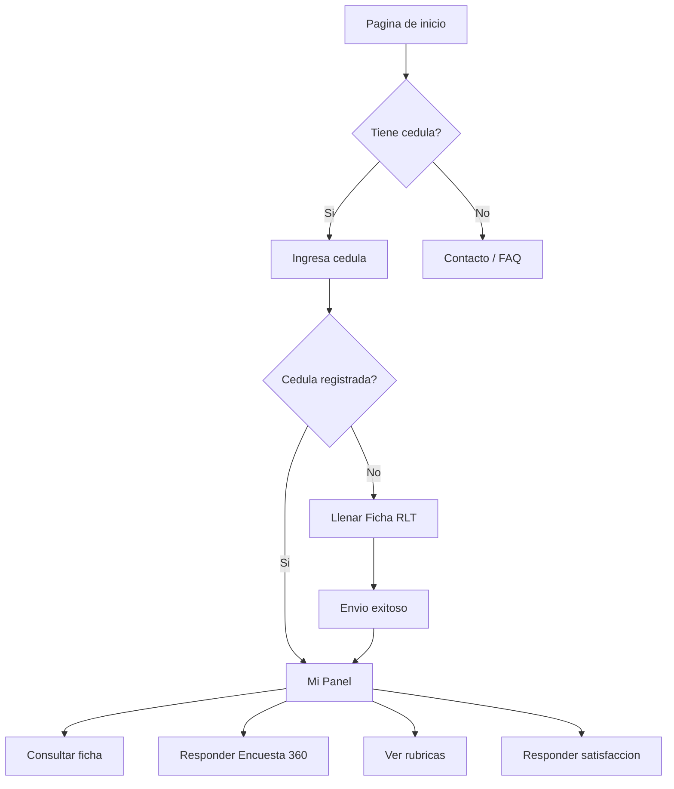

### 3.2 Flujo del Evaluador

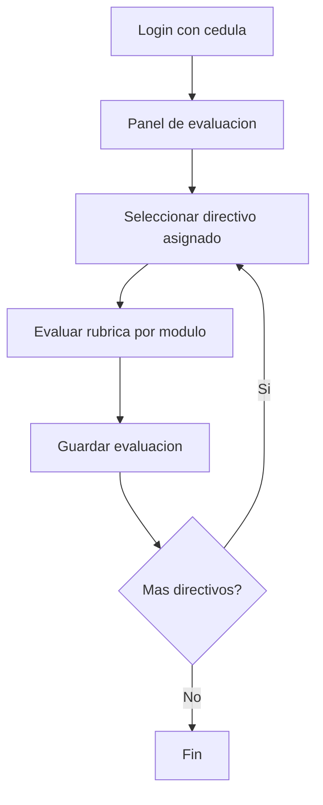

### 3.3 Flujo del Operador

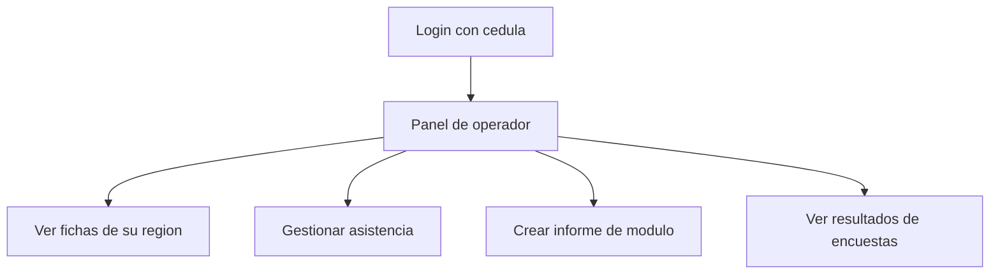

### 3.4 Flujo del Administrador

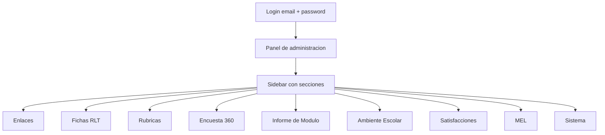

---

## 4. Páginas Públicas

| Página | Ruta | Descripción |
|--------|------|-------------|
| **Inicio** | `/` | Landing con identificación por cédula. Redirige al panel correspondiente según el rol. |
| **Ficha RLT** | `/ficha-rlt` | Formulario extenso de información personal, profesional e institucional del directivo. |
| **Hub Encuesta 360°** | `/encuesta-360` | Página central con enlaces a los 6 formularios de encuesta 360° (entrada y salida). |
| **Encuesta 360° (6 tipos)** | `/encuesta-360-*` | Formularios para docente, estudiante, directivo, acudiente, administrativo y autoevaluación. Fase inicial y final. |
| **Rúbrica de Evaluación** | `/rubrica-evaluacion` | Evaluación por módulo con niveles (Sin evidencia, Básico, Intermedio, Avanzado). |
| **Ambiente Escolar** | `/encuesta-ambiente-*` | 3 formularios: acudientes, estudiantes, docentes. |
| **Satisfacción** | `/satisfaccion-*` | Formularios de satisfacción: asistencia, intensivo, interludio. |
| **Mi Panel** | `/mi-panel` | Panel personal del directivo: ficha, encuestas respondidas, rúbricas. |
| **Panel Operador** | `/operador` | Panel del operador con permisos segmentados por región/entidad. |
| **Contacto** | `/contacto` | Formulario de contacto y sugerencias. |
| **FAQ** | `/faq` | Preguntas frecuentes. |

---

## 5. Panel de Administración — Estructura del Sidebar

```
SIDEBAR
│
├── Enlaces                          (links rápidos a formularios)
│
├── Fichas de Información            (gestión de fichas RLT)
├── Rúbricas                         (evaluaciones por rúbrica)
├── Encuesta 360°                    (encuestas de entrada y salida)
├── Informe de Módulo                (asistencia e informes)
├── Ambiente Escolar                 (encuestas de clima escolar)
├── Satisfacciones                   (encuestas de satisfacción)
├── Certificaciones                  (en construcción)
├── MEL                              (monitoreo y evaluación)
│   ─────────────────────────────
├── Sistema
│   ├── Gestión de Cuentas
│   ├── Registro de Actividad
│   ├── Papelera
│   ├── Apreciaciones *
│   ├── Mensajes *
│   ├── Changelog *
│   └── Purgar datos *
│
│   (* = solo superadmin)
```

---

## 6. Panel de Administración — Detalle por Hub

### 6.1 Enlaces

Página de acceso rápido con enlaces copiables a todos los formularios públicos:

- **Encuestas 360° Entrada**: Docente, Estudiante, Directivo, Acudiente, Administrativo, Autoevaluación
- **Encuestas 360° Salida**: los mismos 6 formularios en fase final
- **Otros formularios**: Ficha RLT, Rúbrica de Evaluación
- **PDFs en blanco**: Generación de PDFs vacíos para impresión (Ficha, 360° por tipo, Rúbrica, Ambiente Escolar por tipo)

Cada enlace tiene un botón de copiar al portapapeles y los PDFs en blanco permiten seleccionar la región (logos RLT/CLT).

---

### 6.2 Fichas de Información (Fichas RLT)

**Sub-tabs internas:**

| Sub-tab | Descripción |
|---------|-------------|
| **Lista** | Tabla paginada de todas las fichas enviadas. Búsqueda por nombre/cédula. Acciones: ver detalle, editar, exportar PDF individual, eliminar (soft-delete). Exportación masiva a Excel. |
| **Enlace y PDF** | Enlace al formulario público + generación de PDF en blanco por región. |
| **Configuración** | **Geografía**: gestión de regiones, entidades territoriales, municipios e instituciones educativas. Permite crear, editar y asignar entidades a regiones. |

---

### 6.3 Rúbricas

**Sub-tabs internas:**

| Sub-tab | Descripción |
|---------|-------------|
| **Resultados** | Vista de todas las evaluaciones de rúbrica por directivo. Filtros por módulo, región, institución. Tabla con niveles alcanzados por ítem. |
| **Informes por módulo** | Generación de informe PDF por módulo: resumen de niveles, distribución, análisis con IA opcional. |
| **Informe regional** | Informe consolidado por región con análisis comparativo entre módulos. Generación de texto IA para análisis. |
| **Configuración** | **Evaluadores**: crear/editar evaluadores (nombre, cédula, email). **Asignaciones**: asignar directivos a evaluadores por institución. |

---

### 6.4 Encuesta 360°

**Sub-tabs internas:**

| Sub-tab | Descripción |
|---------|-------------|
| **Formularios** | Lista de los 6 tipos de formularios con acceso a su enlace público. |
| **Entrada** | Monitoreo de respuestas de la fase inicial. Filtros por tipo de formulario, institución, directivo. Tabla con detalle de cada respuesta. |
| **Salida** | Igual que Entrada pero para la fase final. |
| **Invitaciones** | Gestión de invitaciones enviadas por email. Estado (enviada, respondida), reenvío de recordatorios, conteo de accesos. |
| **Informes Entrada** | Generación de reportes 360° individuales (PDF) para la fase de entrada. Selección por directivo e institución. |
| **Informes Salida** | Igual que Informes Entrada para la fase final. |
| **Configuración** | Sub-tabs de configuración profunda: |

**Sub-tabs de Configuración 360°:**

| Sub-sub-tab | Descripción |
|-------------|-------------|
| **Dominios** | Gestión de los dominios de evaluación (ej: Liderazgo pedagógico, Gestión administrativa). Orden, etiquetas, claves. |
| **Competencias** | Competencias dentro de cada dominio. Orden, etiquetas, claves, asignación a dominio. |
| **Ítems** | Preguntas de evaluación. Cada ítem pertenece a una competencia, tiene un número, tipo de respuesta y textos diferenciados por tipo de formulario. |
| **Ponderaciones** | Pesos asignados a cada competencia según el rol del observador (docente, estudiante, etc.). Determina el cálculo del puntaje final. |

---

### 6.5 Informe de Módulo

**Sub-tabs internas:**

| Sub-tab | Descripción |
|---------|-------------|
| **Asistencia** | Registro de asistencia por directivo, módulo y día. Sesiones AM/PM, razones de inasistencia, observaciones. |
| **Informe de Módulo** | Formulario completo del informe: fechas, equipo, sesiones programadas/realizadas, novedades, estrategias, ajustes, aprendizajes, articulación, acompañamiento, datos individuales por directivo. |
| **Evaluación Individual** | Evaluación cualitativa individual por directivo: avances y retos en dimensiones personal, pedagógica y administrativa. Reto estratégico. |
| **Reportes PDF** | Generación del informe de módulo en PDF con toda la información consolidada. |

---

### 6.6 Ambiente Escolar

**Sub-tabs internas:**

| Sub-tab | Descripción |
|---------|-------------|
| **Monitoreo** | Tabla de respuestas recibidas por tipo de formulario (acudientes, estudiantes, docentes). Filtros por institución. |
| **Estadísticas** | Gráficos y resúmenes estadísticos de las respuestas. Distribución por pregunta, promedios por institución. |
| **Enlaces** | Links a los 3 formularios públicos + generación de PDFs en blanco. |

---

### 6.7 Satisfacciones

**Sub-tabs internas:**

| Sub-tab | Descripción |
|---------|-------------|
| **Respuestas** | Tabla de todas las respuestas de satisfacción. Filtros por tipo (asistencia, intensivo, interludio), módulo y región. |
| **Estadísticas** | Análisis estadístico: promedios por pregunta, distribución de calificaciones, comparación entre módulos y regiones. |
| **Informe PDF** | Generación de informe de satisfacción en PDF con gráficos, análisis por sección y contenido editorial editable. Logos extra configurables por región. |
| **Formularios** | Editor de la definición de los formularios de satisfacción (preguntas, secciones, tipos de respuesta). |
| **Configuración** | Activación/desactivación de formularios por tipo, módulo y región. Fechas de disponibilidad. |

---

### 6.8 Certificaciones

> **En construcción.** Este módulo está planificado pero no implementado aún.

---

### 6.9 MEL (Monitoreo, Evaluación y Aprendizaje)

**Sub-tabs internas:**

| Sub-tab | Descripción |
|---------|-------------|
| **MEL 360°** | Comparación entre encuestas 360° de entrada y salida. Evolución de competencias por directivo e institución. |
| **MEL Rúbricas** | Seguimiento de la evolución de los niveles de rúbrica a través de los módulos. Comparación entre evaluaciones iniciales y de seguimiento. |
| **Configuración** | Gestión de KPIs MEL: indicadores clave, fórmulas de cálculo (porcentaje que alcanza un nivel, mejora entre módulos), metas, umbrales. Grupos de KPIs asignables por región. |

**Sub-tabs de Configuración MEL:**

| Sub-sub-tab | Descripción |
|-------------|-------------|
| **KPIs** | Definición de indicadores: clave, etiqueta, descripción, fórmula, nivel requerido, meta porcentual, módulo objetivo. |
| **Grupos de KPIs** | Agrupaciones de KPIs para asignar a regiones. Cada grupo contiene un subconjunto de KPIs con metas opcionales sobrescritas. |
| **Informe Global** | Generación de informe MEL consolidado en PDF con todos los KPIs, resultados por región y comparativos. |

---

### 6.10 Sistema

| Sección | Acceso | Descripción |
|---------|--------|-------------|
| **Gestión de Cuentas** | Admin | Gestión unificada de todos los usuarios. Creación de cuentas con asignación de roles (admin, superadmin). Gestión de evaluadores (cédula, nombre, email) con asignaciones de directivos. Gestión de operadores con permisos segmentados (sección, región, entidad, institución, módulo). Badges de color por rol. |
| **Registro de Actividad** | Admin | Log de todas las acciones de usuarios: login, envío de formularios, consultas, navegación. Filtros por cédula, tipo de acción, fecha. |
| **Papelera** | Admin | Registros eliminados (soft-delete). Posibilidad de restaurar fichas, encuestas y otros registros eliminados. Filtros por tipo de registro. |
| **Apreciaciones** | Superadmin | Gestión de las reseñas/apreciaciones dejadas por los usuarios sobre la plataforma. Visualización de ratings y comentarios. |
| **Mensajes** | Superadmin | Bandeja de mensajes de contacto recibidos. Marcar como leído/no leído. Filtros por tipo y fecha. |
| **Changelog** | Superadmin | Registro de cambios de la plataforma. Historial de versiones y modificaciones. |
| **Purgar datos** | Superadmin | Eliminación definitiva de datos. Funcionalidad crítica con confirmaciones múltiples. |

---

## 7. Notas Técnicas

### 7.1 Autenticación

- **Directivos, Evaluadores, Operadores**: Identificación por número de cédula (sin contraseña). La cédula determina el rol y los permisos via la tabla `admin_cedulas` y `operator_permissions`.
- **Administradores**: Login con email + contraseña via Supabase Auth. Los roles (`admin`, `superadmin`) se almacenan en la tabla `user_roles`.
- **Seguridad**: Las funciones `has_role()` y `has_admin_access()` se ejecutan como `SECURITY DEFINER` para evitar recursión RLS.

### 7.2 Generación de PDFs

Todos los PDFs se generan en el cliente con **jsPDF**:
- Fichas RLT individuales y en blanco
- Encuestas 360° en blanco (por tipo de formulario)
- Reportes 360° individuales (entrada y salida)
- Rúbricas en blanco y reportes por módulo/regional
- Informes de módulo
- Ambiente escolar en blanco y reportes
- Satisfacción (informes con gráficos)
- MEL global

Cada PDF incluye los logos de la región (RLT y/o CLT) según la configuración de la tabla `regiones`.

### 7.3 Registro de Actividad

El módulo `activityLogger.ts` registra acciones de forma fire-and-forget (sin bloquear la interfaz):
- `login` — Identificación por cédula
- `page_view` — Acceso a páginas
- `ficha_submit` / `ficha_update` / `ficha_view` — Operaciones sobre fichas
- `encuesta_submit` — Envío de encuestas
- `rubrica_access` / `rubrica_submit` — Evaluaciones de rúbrica
- `contact_submit` / `review_submit` — Formularios de contacto
- `logout` — Fin de sesión

### 7.4 Recuperación de Datos

Los registros eliminados se guardan en la tabla `deleted_records` con:
- Tipo de registro (`record_type`)
- Etiqueta identificadora (`record_label`)
- Datos completos en JSON (`deleted_data`)
- Fecha y usuario que eliminó

La papelera permite restaurar registros reinsertándolos en su tabla original.

### 7.5 Permisos de Operador

Los operadores tienen permisos granulares definidos en `operator_permissions`:
- **section**: módulo al que tienen acceso (fichas, informes, encuestas, etc.)
- **region**: región asignada
- **entidad**: entidad territorial específica (opcional)
- **institucion**: institución educativa específica (opcional)
- **module_number**: número de módulo específico (opcional)

### 7.6 Estructura de Base de Datos

**Tablas principales:**

| Tabla | Propósito |
|-------|-----------|
| `fichas_rlt` | Fichas de información de directivos |
| `encuestas_360` | Respuestas de encuestas 360° |
| `rubrica_modules` / `rubrica_items` | Estructura de las rúbricas |
| `rubrica_evaluaciones` | Evaluaciones de rúbrica por directivo |
| `rubrica_seguimientos` | Seguimiento de rúbricas por módulo |
| `rubrica_evaluadores` / `rubrica_asignaciones` | Evaluadores y sus asignaciones |
| `informe_modulo` / `informe_directivo` | Informes de módulo |
| `informe_asistencia` | Asistencia por directivo y módulo |
| `encuestas_ambiente_escolar` | Respuestas de ambiente escolar |
| `satisfaccion_responses` | Respuestas de satisfacción |
| `satisfaccion_config` | Configuración de formularios de satisfacción |
| `satisfaccion_form_definitions` | Definición de formularios editables |
| `domains_360` / `competencies_360` / `items_360` | Estructura de la encuesta 360° |
| `competency_weights` | Ponderaciones por competencia y rol |
| `mel_kpi_config` / `mel_kpi_groups` | Configuración de indicadores MEL |
| `regiones` / `entidades_territoriales` / `municipios` / `instituciones` | Geografía |
| `admin_cedulas` | Cédulas de administradores |
| `operator_permissions` | Permisos de operadores |
| `user_roles` | Roles de usuarios autenticados |
| `user_activity_log` | Registro de actividad |
| `deleted_records` | Papelera de reciclaje |
| `contact_messages` | Mensajes de contacto |
| `site_reviews` | Apreciaciones del sitio |
| `app_settings` / `app_images` | Configuración general e imágenes |

---

## 8. Mindmaps Detallados por Hub

### 8.1 Vue Générale de l'Application

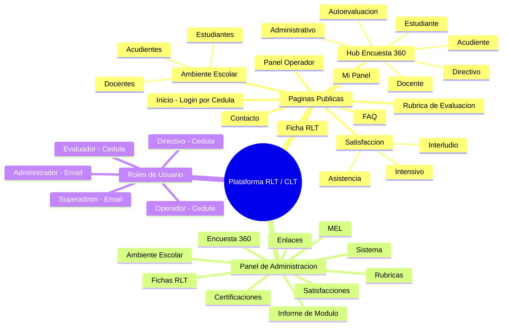

### 8.2 Hub: Enlaces

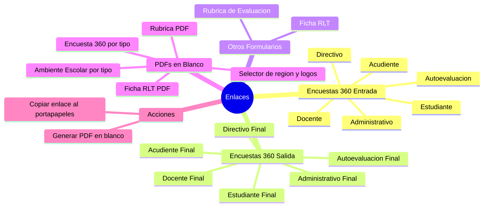

### 8.3 Hub: Fichas RLT

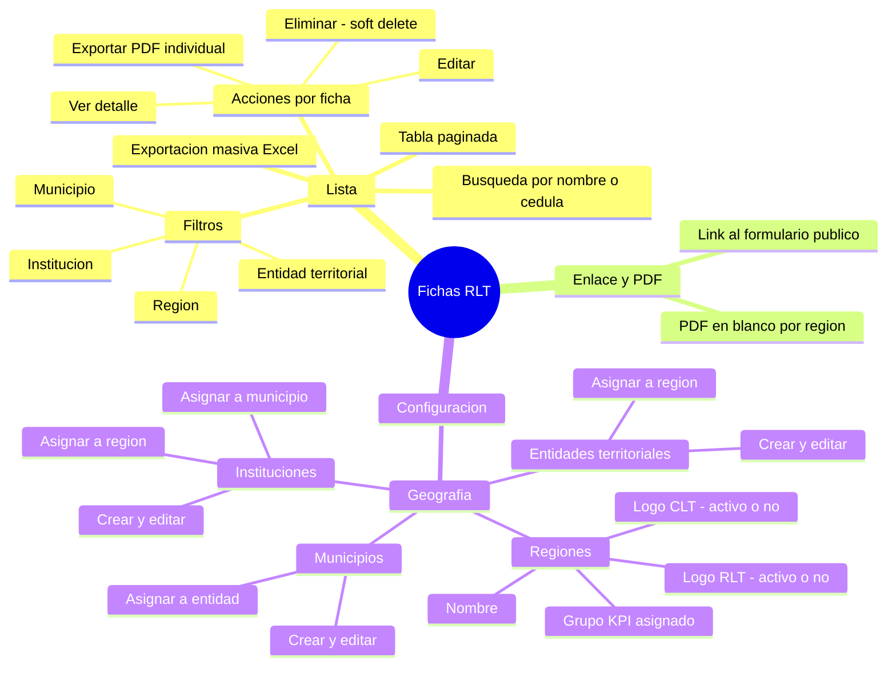

### 8.4 Hub: Rúbricas

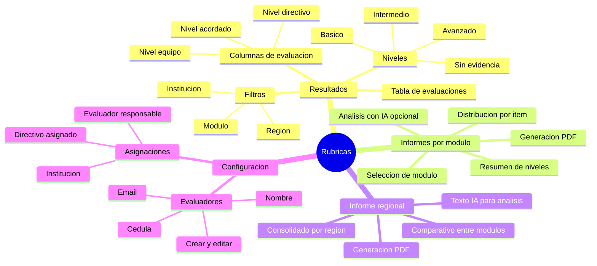

### 8.5 Hub: Encuesta 360°

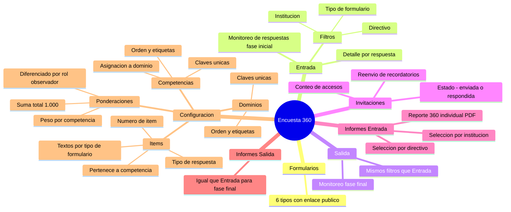

### 8.6 Hub: Informe de Módulo

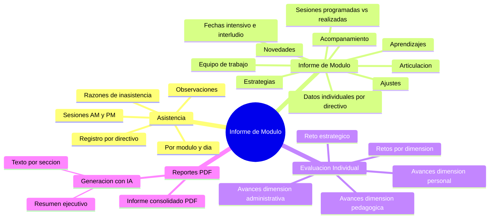

### 8.7 Hub: Ambiente Escolar

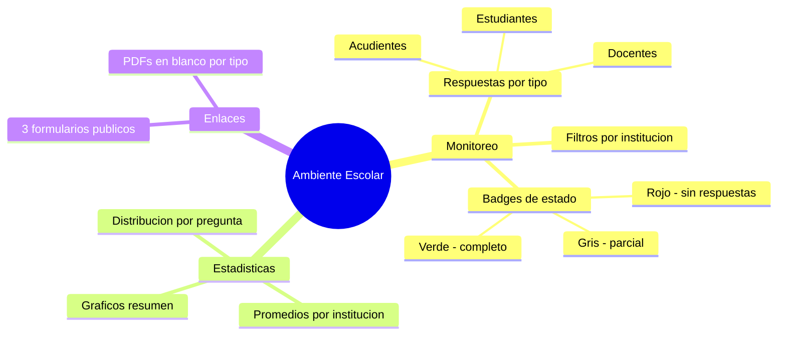

### 8.8 Hub: Satisfacciones

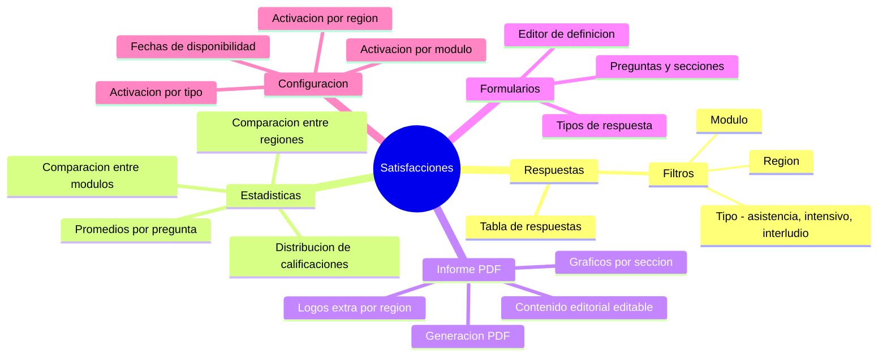

### 8.9 Hub: MEL

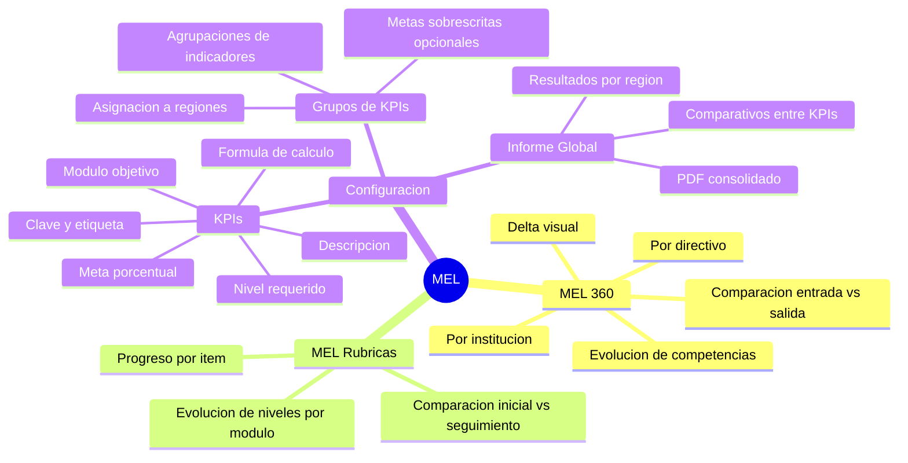

### 8.10 Hub: Sistema

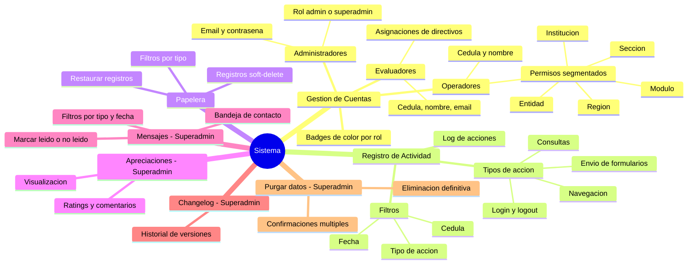
